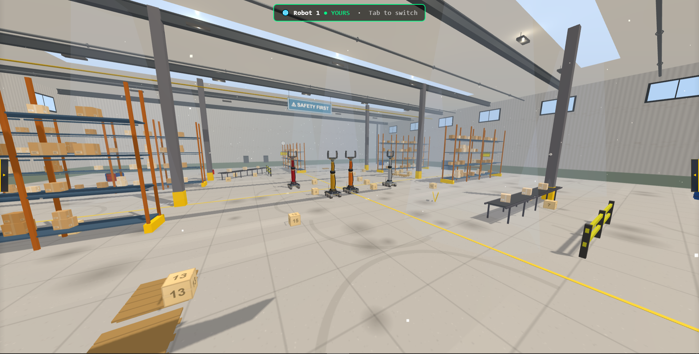
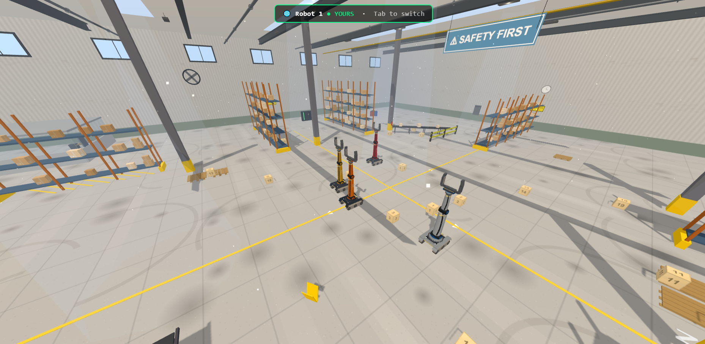
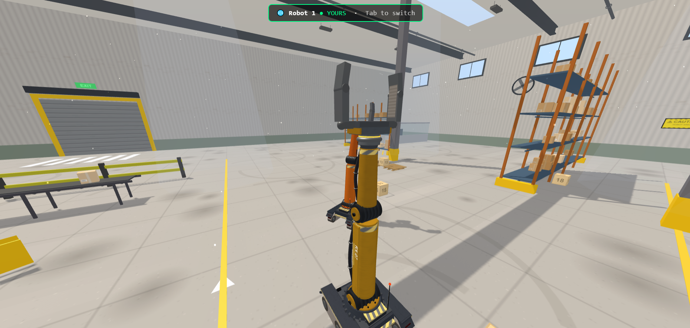

<<<<<<< HEAD
# ARM Robotic — Factory Control

A WebXR-powered robotic arm factory simulation with 4-DOF manipulators, physics-based gripping, computer vision, and multi-user synchronization. Built with Three.js, cannon-es, and Express.

## Screenshots





## Features

### 4-DOF Robotic Arm
- **Base** (rotation): ±180°
- **Shoulder** (pitch): −80° / +85°
- **Elbow** (pitch): −90° / +90°
- **Wrist** (pitch): ±180°
- Dimensions: shoulder 1.1 m, elbow 0.95 m

### Physics Simulation
- **cannon-es** physics engine with per-body `PhysicsController`
- Rigid body dynamics for robots, boxes, and environment
- Freeze/release system to lock idle bodies
- Box: 0.5 m cube, 15 kg mass, purple wireframe overlay

### Gripper & Finger Sensors
- PD-controlled grip: `kp=500`, `kd=50`
- Max grip force: **1200 N**, max load: **50 kg**
- Friction cone model with coefficient **μ=0.8**
- 3 touch sensors per finger (tip, middle, base) with force averaging

### Computer Vision
- 2 virtual cameras per robot:
  - **BODY camera**: mounted on turret, 0.85 m high, −0.3 rad tilt
  - **WRIST camera**: mounted on wrist, −0.15 rad tilt
- 320×240 resolution render targets
- Raycast-based object detection and collision warnings
- Toggleable per-robot or multi-robot view

### Multi-User System
- WebSocket-based synchronization (`ws` library)
- 4 robot slots, one per connected client
- Dynamic robot assignment and claiming
- State broadcast every 50 ms (joint angles, TCP position, box state)
- Persistent robot states on disconnect

### Automation Programs
| Program | Description |
|---|---|
| `test.js` | Event-driven pick-and-place (navigate → approach → contact → grabbed → place → done) |
| `test2.js` | Secondary pick-and-place routine |
| `test3.js` | Third automation sequence |
| `test4.js` | Fourth automation sequence |
| `test-1.js` | Legacy pick-and-place script |
| `autoGrab.js` | Automatic object grasping |
| `autoRelease.js` | Automatic object release |

### VR / AR Mode
- WebXR immersive mode buttons
- VR and AR session support
- Status indicators for XR availability
- **Advanced VR Interaction System:**
  - 🎮 **VR Controllers**: Thumbstick mapping for base movement and joint control, trigger for raycast interaction and grabbing, squeeze for analog gripper control.
  - 🖐️ **Hand Tracking**: Pinch gestures for raycast interaction/grabbing, fist/open hand for gripper control, and thumbs up to switch robots.
  - 🖥️ **VR 3D UI**: Floating interactive canvas panel with sliders, buttons, and live telemetry data. Fully operable via raycast or pinch.

### 3D Factory Environment
- **60 × 60 × 12 m** industrial scene
- 2.5 m tall walls, floor tiles
- 2 shelves (3 levels each, 32 box slots)
- 2 conveyor belts
- 4 x 55-gallon barrels, 2 pallets, 2 guard rails
- 2 overhead lights with shadow support
- Procedural textures (brushed metal, checkerboard)
- 4 robots at positions: `(−2,0,−2)`, `(2,0,−2)`, `(−2,0,3)`, `(2,0,3)`

## Tech Stack

| Layer | Technology |
|---|---|
| Frontend | Three.js r183, cannon-es |
| Backend | Node.js, Express 5 |
| Real-time | ws (WebSocket) |
| XR | WebXR API |
| Vision | Three.js render targets + raycasting |
| Physics | cannon-es |
| Serialization | JSON over WebSocket |

## Getting Started

### Prerequisites
- Node.js ≥ 18
- SSL certificates (`server-key.pem` and `server.pem` in project root)

### Install

```bash
npm install
```

### Run

```bash
node server.js
```

Open **https://localhost:3000** in a browser (HTTPS required for WebXR).

### Generate SSL Certificates (development)

```bash
openssl req -x509 -newkey rsa:2048 -keyout server-key.pem -out server.pem -days 365 -nodes
```

## Project Structure

```
├── index.html                  # Main entry point
├── server.js                   # HTTPS + WebSocket server
├── package.json
├── favicon.ico
├── server-key.pem              # SSL key
├── server.pem                  # SSL cert
├── public/
│   └── css/
│       └── style.css           # Application stylesheet
└── src/
    ├── main.js                 # Application bootstrap
    ├── xr/
    │   ├── VRControllerManager.js  # VR physical controllers support
    │   ├── HandTrackingController.js # VR hand tracking and gestures
    │   └── VRUI.js                 # Floating 3D VR UI panel
    ├── core/
    │   ├── Robot.js            # Robot controller
    │   ├── Robot3D.js          # 3D visual representation
    │   ├── RobotListener.js    # Event listener base
    │   ├── PhysicsController.js# Physics engine wrapper
    │   ├── createRobot.js      # Robot factory
    │   ├── defaultDescription.js# Default config
    │   └── MultiuserSync.js    # Multi-user sync client
    ├── environment/
    │   ├── Environment.js      # Scene setup
    │   └── factory.js          # Factory builder
    ├── sensors/
    │   └── FingerSensor.js     # Touch/force sensors
    ├── logic/
    │   ├── gripLogic.js        # Gripper controller
    │   └── GripController.js   # Low-level grip PD
    ├── vision/
    │   └── RobotVision.js      # Computer vision system
    ├── ui/
    │   ├── telemetry.js        # Data display
    │   └── log.js              # Console logger
    └── programs/
        ├── test-1.js           # Legacy pick-and-place
        ├── test.js             # Event-driven pick-and-place
        ├── test2.js            # Automation v2
        ├── test3.js            # Automation v3
        ├── test4.js            # Automation v4
        ├── autoGrab.js         # Auto grasp
        └── autoRelease.js      # Auto release
```

## Architecture Overview

```
index.html
  └── src/main.js
       ├── xr/ ──────────────────── WebXR Interaction (Controllers, Hand Tracking, UI)
       ├── Robot.js ─────────────── robot control (joints, IK, motion)
       │    └── Robot3D.js ──────── 3D rendering + physics body
       │         ├── createRobot.js
       │         └── GripController.js
       ├── PhysicsController.js ─── cannon-es wrapper
       ├── RobotListener.js ─────── event system
       ├── FingerSensor.js ──────── touch sensors
       ├── Environment.js ───────── 3D scene
       │    └── factory.js ──────── factory geometry
       ├── gripLogic.js ─────────── grip state machine
       ├── RobotVision.js ───────── virtual cameras
       ├── MultiuserSync.js ─────── WebSocket sync
       ├── telemetry.js ─────────── UI data panel
       └── log.js ───────────────── console logger
```

## API

### Robot Control (via `window.activeRobot`)

```js
// Move joints
robot.setJointAngles(base, shoulder, elbow, wrist);
robot.setJointAngle(index, degrees);

// Gripper
robot.setGripOpening(mm);       // 14–55 mm
robot.grip();                   // Close with max force
robot.release();                // Open gripper

// Motion
robot.moveTo(x, y, z);         // IK to target position
robot.moveJoint(index, degrees, duration);

// Status
robot.getJointAngles();
robot.getTcpPosition();
```

### Programs

```js
// Access via window.activeRobot
window.activeRobot.task2.pickAndPlace(boxObject);
window.activeRobot.grab();
window.activeRobot.release();
```

## License

ISC
=======
# mmohcen212-project


## Getting started

To make it easy for you to get started with GitLab, here's a list of recommended next steps.

Already a pro? Just edit this README.md and make it your own. Want to make it easy? [Use the template at the bottom](#editing-this-readme)!

## Add your files

* [Create](https://docs.gitlab.com/user/project/repository/web_editor/#create-a-file) or [upload](https://docs.gitlab.com/user/project/repository/web_editor/#upload-a-file) files
* [Add files using the command line](https://docs.gitlab.com/topics/git/add_files/#add-files-to-a-git-repository) or push an existing Git repository with the following command:

```
cd existing_repo
git remote add origin https://gitlab.com/mmohcen212-group/mmohcen212-project.git
git branch -M main
git push -uf origin main
```

## Integrate with your tools

* [Set up project integrations](https://gitlab.com/mmohcen212-group/mmohcen212-project/-/settings/integrations)

## Collaborate with your team

* [Invite team members and collaborators](https://docs.gitlab.com/user/project/members/)
* [Create a new merge request](https://docs.gitlab.com/user/project/merge_requests/creating_merge_requests/)
* [Automatically close issues from merge requests](https://docs.gitlab.com/user/project/issues/managing_issues/#closing-issues-automatically)
* [Enable merge request approvals](https://docs.gitlab.com/user/project/merge_requests/approvals/)
* [Set auto-merge](https://docs.gitlab.com/user/project/merge_requests/auto_merge/)

## Test and Deploy

Use the built-in continuous integration in GitLab.

* [Get started with GitLab CI/CD](https://docs.gitlab.com/ci/quick_start/)
* [Analyze your code for known vulnerabilities with Static Application Security Testing (SAST)](https://docs.gitlab.com/user/application_security/sast/)
* [Deploy to Kubernetes, Amazon EC2, or Amazon ECS using Auto Deploy](https://docs.gitlab.com/topics/autodevops/requirements/)
* [Use pull-based deployments for improved Kubernetes management](https://docs.gitlab.com/user/clusters/agent/)
* [Set up protected environments](https://docs.gitlab.com/ci/environments/protected_environments/)

***

# Editing this README

When you're ready to make this README your own, just edit this file and use the handy template below (or feel free to structure it however you want - this is just a starting point!). Thanks to [makeareadme.com](https://www.makeareadme.com/) for this template.

## Suggestions for a good README

Every project is different, so consider which of these sections apply to yours. The sections used in the template are suggestions for most open source projects. Also keep in mind that while a README can be too long and detailed, too long is better than too short. If you think your README is too long, consider utilizing another form of documentation rather than cutting out information.

## Name
Choose a self-explaining name for your project.

## Description
Let people know what your project can do specifically. Provide context and add a link to any reference visitors might be unfamiliar with. A list of Features or a Background subsection can also be added here. If there are alternatives to your project, this is a good place to list differentiating factors.

## Badges
On some READMEs, you may see small images that convey metadata, such as whether or not all the tests are passing for the project. You can use Shields to add some to your README. Many services also have instructions for adding a badge.

## Visuals
Depending on what you are making, it can be a good idea to include screenshots or even a video (you'll frequently see GIFs rather than actual videos). Tools like ttygif can help, but check out Asciinema for a more sophisticated method.

## Installation
Within a particular ecosystem, there may be a common way of installing things, such as using Yarn, NuGet, or Homebrew. However, consider the possibility that whoever is reading your README is a novice and would like more guidance. Listing specific steps helps remove ambiguity and gets people to using your project as quickly as possible. If it only runs in a specific context like a particular programming language version or operating system or has dependencies that have to be installed manually, also add a Requirements subsection.

## Usage
Use examples liberally, and show the expected output if you can. It's helpful to have inline the smallest example of usage that you can demonstrate, while providing links to more sophisticated examples if they are too long to reasonably include in the README.

## Support
Tell people where they can go to for help. It can be any combination of an issue tracker, a chat room, an email address, etc.

## Roadmap
If you have ideas for releases in the future, it is a good idea to list them in the README.

## Contributing
State if you are open to contributions and what your requirements are for accepting them.

For people who want to make changes to your project, it's helpful to have some documentation on how to get started. Perhaps there is a script that they should run or some environment variables that they need to set. Make these steps explicit. These instructions could also be useful to your future self.

You can also document commands to lint the code or run tests. These steps help to ensure high code quality and reduce the likelihood that the changes inadvertently break something. Having instructions for running tests is especially helpful if it requires external setup, such as starting a Selenium server for testing in a browser.

## Authors and acknowledgment
Show your appreciation to those who have contributed to the project.

## License
For open source projects, say how it is licensed.

## Project status
If you have run out of energy or time for your project, put a note at the top of the README saying that development has slowed down or stopped completely. Someone may choose to fork your project or volunteer to step in as a maintainer or owner, allowing your project to keep going. You can also make an explicit request for maintainers.
>>>>>>> 7e751dcbc47022f39c0820b52a6fbbe649988ea5
