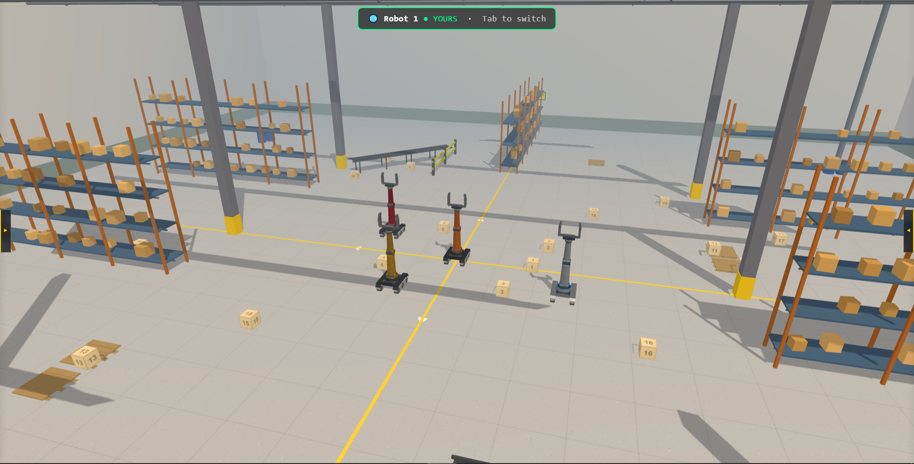
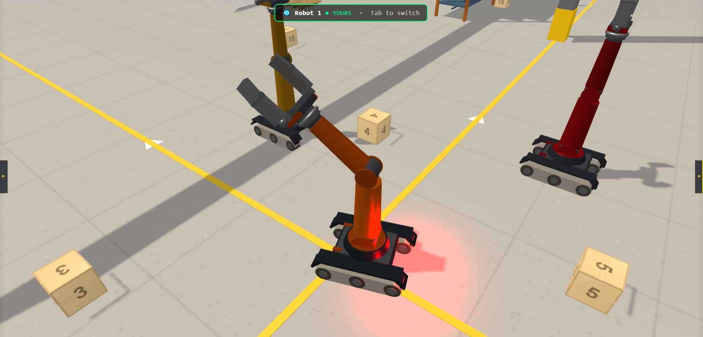

# ARM Robotic — Factory Control

A WebXR-powered robotic arm factory simulation with 4-DOF manipulators, physics-based gripping, computer vision, and multi-user synchronization. Built with Three.js, cannon-es, and Express.

## Screenshots






## Features

### 4-DOF Robotic Arm
- **Base** (rotation): ±180°
- **Shoulder** (pitch): −80° / +85°
- **Elbow** (pitch): −90° / +90°
- **Wrist** (pitch): ±180°
- Dimensions: shoulder 1.1 m, elbow 0.95 m

### Physics Simulation
- **cannon-es** physics engine with per-body `PhysicsController`
- Rigid body dynamics for robots, boxes, and environment
- Freeze/release system to lock idle bodies
- Box: 0.5 m cube, 15 kg mass, purple wireframe overlay

### Gripper & Finger Sensors
- PD-controlled grip: `kp=500`, `kd=50`
- Max grip force: **1200 N**, max load: **50 kg**
- Friction cone model with coefficient **μ=0.8**
- 3 touch sensors per finger (tip, middle, base) with force averaging

### Computer Vision
- 2 virtual cameras per robot:
  - **BODY camera**: mounted on turret, 0.85 m high, −0.3 rad tilt
  - **WRIST camera**: mounted on wrist, −0.15 rad tilt
- 320×240 resolution render targets
- Raycast-based object detection and collision warnings
- Toggleable per-robot or multi-robot view

### Multi-User System
- WebSocket-based synchronization (`ws` library)
- 4 robot slots, one per connected client
- Dynamic robot assignment and claiming
- State broadcast every 50 ms (joint angles, TCP position, box state)
- Persistent robot states on disconnect

### Automation Programs
| Program | Description |
|---|---|
| `test.js` | Event-driven pick-and-place (navigate → approach → contact → grabbed → place → done) |
| `test2.js` | Secondary pick-and-place routine |
| `test3.js` | Third automation sequence |
| `test4.js` | Fourth automation sequence |
| `test-1.js` | Legacy pick-and-place script |
| `autoGrab.js` | Automatic object grasping |
| `autoRelease.js` | Automatic object release |

### VR / AR Mode
- WebXR immersive mode buttons
- VR and AR session support
- Status indicators for XR availability
- **Advanced VR Interaction System:**
  - 🎮 **VR Controllers**: Thumbstick mapping for base movement and joint control, trigger for raycast interaction and grabbing, squeeze for analog gripper control.
  - 🖐️ **Hand Tracking**: Pinch gestures for raycast interaction/grabbing, fist/open hand for gripper control, and thumbs up to switch robots.
  - 🖥️ **VR 3D UI**: Floating interactive canvas panel with sliders, buttons, and live telemetry data. Fully operable via raycast or pinch.

### 3D Factory Environment
- **60 × 60 × 12 m** industrial scene
- 2.5 m tall walls, floor tiles
- 2 shelves (3 levels each, 32 box slots)
- 2 conveyor belts
- 4 x 55-gallon barrels, 2 pallets, 2 guard rails
- 2 overhead lights with shadow support
- Procedural textures (brushed metal, checkerboard)
- 4 robots at positions: `(−2,0,−2)`, `(2,0,−2)`, `(−2,0,3)`, `(2,0,3)`

## Tech Stack

| Layer | Technology |
|---|---|
| Frontend | Three.js r183, cannon-es |
| Backend | Node.js, Express 5 |
| Real-time | ws (WebSocket) |
| XR | WebXR API |
| Vision | Three.js render targets + raycasting |
| Physics | cannon-es |
| Serialization | JSON over WebSocket |

## Getting Started

### Prerequisites
- Node.js ≥ 18
- SSL certificates (`server-key.pem` and `server.pem` in project root)

### Install

```bash
npm install
```

### Run

```bash
node server.js
```

Open **https://localhost:3000** in a browser (HTTPS required for WebXR).

### Generate SSL Certificates (development)

```bash
openssl req -x509 -newkey rsa:2048 -keyout server-key.pem -out server.pem -days 365 -nodes
```

## Project Structure

```
├── index.html                  # Main entry point
├── server.js                   # HTTPS + WebSocket server
├── package.json
├── favicon.ico
├── server-key.pem              # SSL key
├── server.pem                  # SSL cert
├── public/
│   └── css/
│       └── style.css           # Application stylesheet
└── src/
    ├── main.js                 # Application bootstrap
    ├── xr/
    │   ├── VRControllerManager.js  # VR physical controllers support
    │   ├── HandTrackingController.js # VR hand tracking and gestures
    │   └── VRUI.js                 # Floating 3D VR UI panel
    ├── core/
    │   ├── Robot.js            # Robot controller
    │   ├── Robot3D.js          # 3D visual representation
    │   ├── RobotListener.js    # Event listener base
    │   ├── PhysicsController.js# Physics engine wrapper
    │   ├── createRobot.js      # Robot factory
    │   ├── defaultDescription.js# Default config
    │   └── MultiuserSync.js    # Multi-user sync client
    ├── environment/
    │   ├── Environment.js      # Scene setup
    │   └── factory.js          # Factory builder
    ├── sensors/
    │   └── FingerSensor.js     # Touch/force sensors
    ├── logic/
    │   ├── gripLogic.js        # Gripper controller
    │   └── GripController.js   # Low-level grip PD
    ├── vision/
    │   └── RobotVision.js      # Computer vision system
    ├── ui/
    │   ├── telemetry.js        # Data display
    │   └── log.js              # Console logger
    └── programs/
        ├── test-1.js           # Legacy pick-and-place
        ├── test.js             # Event-driven pick-and-place
        ├── test2.js            # Automation v2
        ├── test3.js            # Automation v3
        ├── test4.js            # Automation v4
        ├── autoGrab.js         # Auto grasp
        └── autoRelease.js      # Auto release
```

## Architecture Overview

```
index.html
  └── src/main.js
       ├── xr/ ──────────────────── WebXR Interaction (Controllers, Hand Tracking, UI)
       ├── Robot.js ─────────────── robot control (joints, IK, motion)
       │    └── Robot3D.js ──────── 3D rendering + physics body
       │         ├── createRobot.js
       │         └── GripController.js
       ├── PhysicsController.js ─── cannon-es wrapper
       ├── RobotListener.js ─────── event system
       ├── FingerSensor.js ──────── touch sensors
       ├── Environment.js ───────── 3D scene
       │    └── factory.js ──────── factory geometry
       ├── gripLogic.js ─────────── grip state machine
       ├── RobotVision.js ───────── virtual cameras
       ├── MultiuserSync.js ─────── WebSocket sync
       ├── telemetry.js ─────────── UI data panel
       └── log.js ───────────────── console logger
```

## API

### Robot Control (via `window.activeRobot`)

```js
// Move joints
robot.setJointAngles(base, shoulder, elbow, wrist);
robot.setJointAngle(index, degrees);

// Gripper
robot.setGripOpening(mm);       // 14–55 mm
robot.grip();                   // Close with max force
robot.release();                // Open gripper

// Motion
robot.moveTo(x, y, z);         // IK to target position
robot.moveJoint(index, degrees, duration);

// Status
robot.getJointAngles();
robot.getTcpPosition();
```

### Programs

```js
// Access via window.activeRobot
window.activeRobot.task2.pickAndPlace(boxObject);
window.activeRobot.grab();
window.activeRobot.release();
```

## License

ISC
